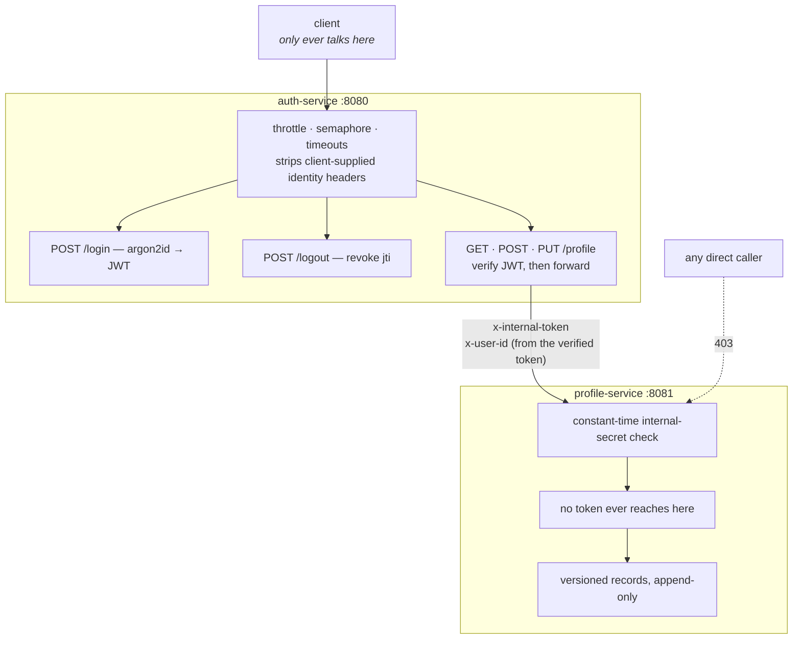
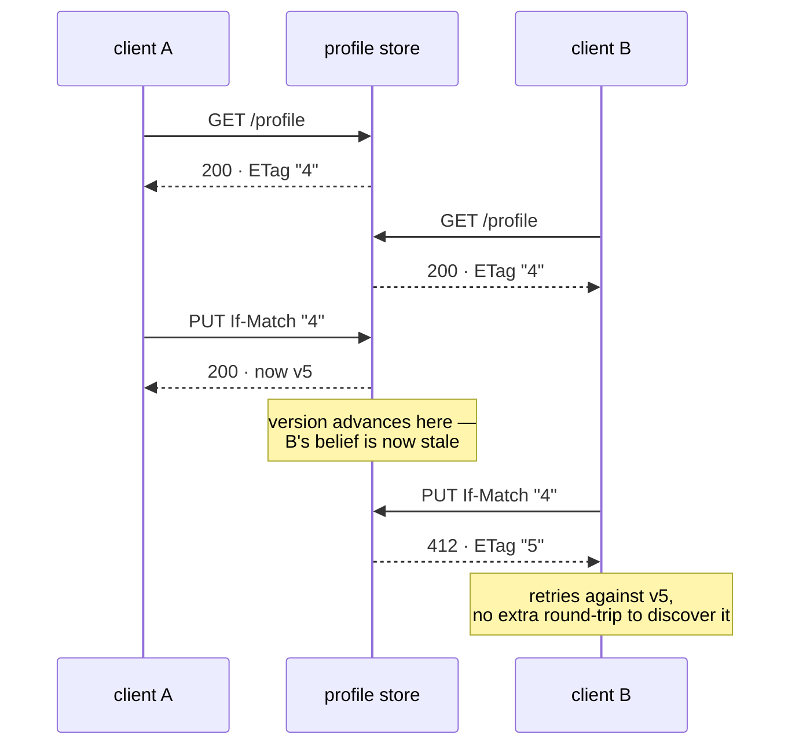

# Knova coding exercise — auth + profile services

Two Rust microservices. The authorization service owns credentials and fronts
the profile service as an API gateway; clients never address the profile
service directly.

## Walkthrough

The slide deck, inline. Ten slides; the detailed write-up for each point is
further down. A self-contained HTML version is in [`docs/walkthrough.html`](docs/walkthrough.html),
alongside a source browser in [`docs/source.html`](docs/source.html).

---

### 01 · Knova — Senior Rust Engineer

> ## Lost updates and enumeration oracles.

Two microservices are forty-five minutes of work. The exercise is really asking
two questions: can you tell the difference between three kinds of concurrency
bug, and do you know that matching a status code is only half of hiding whether
an account exists.

| | |
|---|---|
| **52** | tests, all green |
| **0** | clippy findings at pedantic |
| **+18%** | gateway throughput, one line |

---

### 02 · Architecture

> ## One trust boundary, crossed once.

The profile service never sees a token and never validates one. Verification
lives in exactly one place.



---

### 03 · The concurrency question

> ## Three hazards. Only one is hard.

| Hazard | What it looks like | What fixes it |
|---|---|---|
| **data race** | two threads, same bytes, no synchronisation | the compiler. No design effort — I don't claim credit for it. |
| **torn write** | new address beside the old phone number | any lock around the record |
| **lost update** | two clients edit v4, second silently erases the first, both get 200 | **no lock can fix this** — the window spans two round-trips with human think-time in it |

**Why a mutex isn't the answer.** You cannot hold a lock across a user's coffee
break. The read and the write are separate requests.

**What is.** Optimistic concurrency. The record carries a version; a writer
states which version it believes it is replacing; a stale belief is refused.

---

### 04 · The decision

> ## If-Match is mandatory, not optional.



- **428, not 200.** A PUT with no `If-Match` can't say which version it means to replace. Refused.
- **`*` is rejected.** `If-Match: *` means "any version" — exactly the overwrite this prevents.
- **412 carries the ETag.** So the client retries without a second round-trip to discover what it lost to.

---

### 05 · Scalability

> ## The guarantee has to outlive the HashMap.

A process-local store makes `If-Match: "4"` meaningful only to the instance that
issued version 4. Behind a load balancer with three replicas there are three
histories and the guarantee is void. So storage is a trait, with two real
backends.

**In-memory · default**

```text
[ RwLock<HashMap<UserId, Arc<Record>>> ; 64 ]
  ^^^^^^ sharded, 4 per core

Record { ArcSwap<Profile>, Mutex<Vec<Revision>> }
         ^^^^^^^ reads take no lock at all
```

Shard guard released before the entry is touched — holding both is a global lock
in disguise.

**SQLite · same contract**

```sql
UPDATE profiles SET version = ?
WHERE user_id = ? AND version = ?
```

Row count decides. One row: applied. Zero: stale or missing, told apart by a read
in the same transaction.

| Evidence | Result |
|---|---|
| One conformance suite, both backends | **8 × 2 PASS** |
| Delete the `AND version = ?` predicate from either | **3 FAIL, SYMMETRIC** |

---

### 06 · Measurement

> ## I optimised the wrong thing first.

Round one tuned the store and the middleware, in-process, and got real numbers.
Round two measured the running system over real HTTP and made most of round one
irrelevant.

**Round one · in-process**

| | gain |
|---|---|
| shard the map (64 shards) | +52% store reads |
| merge two middleware layers | 439 ns/req |
| store read, as share of a request | 1.5% |

Each `from_fn` layer costs ~900 ns whatever it does — more than the handler it guards.

**Round two · the real system**

| | req/sec | p50 |
|---|---|---|
| direct to profile | 64,158 | 898 µs |
| through the gateway | 25,414 | 2.42 ms |

The hop costs **60% of throughput** — ~29 µs/request. Everything in round one
totalled 439 nanoseconds. The hop is **67× larger than all of it**.

The biggest win was a bug I wrote: `EnvFilter` default `"info,tower_http=debug"`
→ two formatted log lines per request · 320,006 lines across a 160,000-request
run → changing it to `"info"`: **+18% throughput, −0.45 ms p50**, and it stops
filling a disk in production.

---

### 07 · Security

> ## Matching the body is the easy half.

**Structural, not conventional**

```rust
pub enum Authentication {
    Authenticated(Arc<UserRecord>),
    Rejected,
}
```

Unknown username and wrong password both produce `Rejected`. The distinction
never leaves the module, so no handler can leak what it was never given.

**And the timing half.** A lookup miss verifies against a decoy hash — a real
Argon2 hash of a value no account holds. Same work, always false. A throttled
account gets the identical 401 and still pays for a full verification; otherwise
lockout becomes the oracle: five failures tells you the username is real.

| Measured | Unknown user | Known, wrong password |
|---|---|---|
| before warming the decoy | 0.94 s | 0.47 s |
| after | 0.46 s | 0.46 s |

The decoy sat behind a `OnceLock`, so the first unknown-username login per
process computed it and then verified against it — two Argon2 passes where a real
account costs one. Found in a stray outlier in an unrelated throttle test.

---

### 08 · Where AI got it wrong

> ## Three, ascending by cost.

1. **Reflex.** `tokio::sync::Mutex` because "it's async code". No critical
   section here crosses an `.await`, so the std lock is correct and faster. The
   tell is a justification about the file, not about the code.
2. **Silent leak.** `#[derive(Debug)]` on a struct holding `jwt_secret`. One
   `tracing::debug!(?config)` from putting the signing key in the log
   aggregator. Nothing warns — not rustc, not clippy.
3. **A vacuous test.** My own. 64 writers, assert version is 65. **It passed on
   deliberately broken code** — last-write-wins also accepts every write and also
   bumps the version.

```text
MUTANT: compare-and-swap predicate removed
FAILED  stale_update_is_rejected
FAILED  concurrent_increments_never_lose_an_update
ok      concurrent_writes_are_never_torn   ← correctly survives: the mutex is untouched
```

The fix was making each writer's value depend on what it read — a shared counter,
64 increments, final must be 64. Counting accepted writes can never distinguish
the two designs. A suite where every test dies on every mutation isn't precise
either.

---

### 09 · Agentic reflection

> ## Specify the invariant, design the falsification.

**Delegate.** Mechanical breadth. Scaffolding, the fourth endpoint that looks
like the first three, exhaustive error paths, doc comments, guideline audits.
Adversarial review — "what would make CI reject this" is a question an agent
answers tirelessly and a human answers once.

**Keep deterministic.** Anything where being right beats being fast and the check
is cheap. `forbid(unsafe_code)`, pedantic clippy, `missing_docs`, mutation runs.
Policy an agent cannot argue with.

**Keep human.** The trust boundary. Where the internal token is checked, what the
gateway strips, whether `If-Match` is mandatory. An agent will happily make it
optional because that's friendlier, and nothing goes red.

**The engineer's job.** The code was the cheap part. The expensive parts were
deciding lost updates were the real requirement, and noticing the test for it
proved nothing. Reviewing generated code line by line does not scale; deciding
what would prove it wrong does.

**Getting context to an agent.** Ascending by cost: commit it (README,
architecture notes); **encode it as executable checks** so it's enforced rather
than remembered; give the agent tools to discover it — run the tests, fetch the
API guidelines, curl the running service. Only genuinely external constraints go
in the prompt.

---

### 10 · With more time

> ## What I know is still wrong.

**Closed under "if this were a bank"**

- **Upstream timeouts** — reqwest has none by default; a hanging upstream hung every gateway request forever. Now 502 at 5.01 s.
- **Login memory bound** — Argon2 at 19 MiB × 512 blocking threads ≈ 9.7 GiB from one attacker. Now sheds with 503.
- **Audit trail** — a profile is a projection of its revisions. An address change is a KYC signal; overwriting destroyed the evidence.
- Idempotency, revocation, key rotation, throttling, correlation.

**Still open, honestly**

- The gateway hop is 60% of throughput and no tuning change fixes it. Removing it for reads means either verifying tokens in both services — giving up the single trust boundary — or caching at the gateway, which reintroduces the staleness the version counter exists to prevent.
- Throttle and idempotency state is per-process — the same flaw the profile store had. Five replicas means five counters and a limit five times what it says.
- One SQLite connection behind a mutex — right for `:memory:`, needs a pool otherwise.
- No metrics — spans correlate, but nothing alerts on throttle trips or 412 rate.

And a caveat worth saying out loud: this is past a three-hour timebox. The
in-memory backend alone satisfies the brief. I kept the rest because per-process
versioning is the design's real limit, and I wanted to show it wasn't
load-bearing.

---

## Running it

```bash
cargo run -p profile-service &   # :8081
cargo run -p auth-service &      # :8080
```

Seeded account: `alice` / `correct-horse-battery-staple`.

```bash
TOKEN=$(curl -s -X POST localhost:8080/login \
  -H 'content-type: application/json' \
  -d '{"username":"alice","password":"correct-horse-battery-staple"}' \
  | jq -r .access_token)

# create -> 201, ETag: "1"
curl -i -X POST localhost:8080/profile -H "authorization: Bearer $TOKEN" \
  -H 'content-type: application/json' \
  -d '{"address":"1 Main St","phone_number":"555-0100"}'

# update -> 200, ETag: "2"
curl -i -X PUT localhost:8080/profile -H "authorization: Bearer $TOKEN" \
  -H 'content-type: application/json' -H 'if-match: "1"' \
  -d '{"address":"2 Oak Ave","phone_number":"555-0200"}'

# replay the stale version -> 412, with the current ETag so you can retry
curl -i -X PUT localhost:8080/profile -H "authorization: Bearer $TOKEN" \
  -H 'content-type: application/json' -H 'if-match: "1"' \
  -d '{"address":"clobber","phone_number":"000"}'
```

### Tests

```bash
cargo test --workspace
cargo clippy --workspace --all-targets   # pedantic, clean
```

### Benchmarks

In-process store and middleware measurements:

```bash
cargo test -p profile-service --release --test read_contention -- --ignored --nocapture
```

The running system over real HTTP, with both services up:

```bash
cargo run --release -p loadgen -- direct  64 2000
cargo run --release -p loadgen -- gateway 64 2000
```

### Configuration

All values have development defaults; nothing needs to be set to run locally.

| Variable | Default | Used by |
|---|---|---|
| `AUTH_BIND_ADDR` | `127.0.0.1:8080` | auth |
| `PROFILE_BIND_ADDR` | `127.0.0.1:8081` | profile |
| `JWT_SECRET` | dev placeholder | auth |
| `TOKEN_TTL_SECS` | `900` | auth |
| `INTERNAL_TOKEN` | dev placeholder | both |
| `PROFILE_BACKEND` | `memory` (or `sqlite`) | profile |
| `JWT_ACTIVE_KID` | `k1` | auth |
| `JWT_RETIRED_KEYS` | empty; `kid=secret;kid=secret` | auth |
| `PROFILE_SERVICE_URL` | `http://127.0.0.1:8081` | auth |
| `SEED_USERNAME` / `SEED_PASSWORD` | `alice` / `correct-horse-battery-staple` | auth |

## Requirement 1 — concurrency correctness

Three hazards get conflated under "concurrency". They need different answers.

**Data races.** Ruled out by the compiler. Sharing across threads needs `Sync`,
mutation needs exclusive access. No design effort spent; it is not the
interesting part and I would not claim credit for it.

**Torn writes** — a reader seeing the new address beside the old phone number.
Any lock around the whole record prevents this. The per-entry `Mutex` does.

**Lost updates** — the one that matters, and the one **a mutex cannot fix**. Two
clients `GET` version 4, both edit, both `PUT`. The second silently erases the
first, and *both* get `200`. The window spans two round-trips with human
think-time in between, so holding a lock across it is not an option.

The answer is optimistic concurrency control. Each record carries a version; a
writer states the version it believes it is replacing; the store refuses the
write if that belief is stale. Over HTTP that is `ETag` / `If-Match`, so it is
[RFC 9110] semantics rather than a bespoke protocol.

| Request | Response |
|---|---|
| `POST`, no profile yet | `201` + `ETag: "1"` |
| `POST`, profile exists | `409` |
| `GET` | `200` + `ETag: "n"`, or `404` |
| `PUT`, no `If-Match` | `428 Precondition Required` |
| `PUT`, stale `If-Match` | `412` + `ETag` of the version that won |
| `PUT`, current `If-Match` | `200` + `ETag: "n+1"` |
| `GET /profile/history` | `200` — every accepted revision, oldest first |
| `POST` with `Idempotency-Key`, retried | the original response replayed, not `409` |
| `POST /logout` | `204`; the token is dead before its `exp` |

Versions are a `common::Version` newtype rather than a bare `u64`. Its `Display`
writes the entity tag (`"3"`, quotes included) and its `FromStr` parses one, so
the value stored and the value on the wire cannot drift; `*` is rejected there,
in one place, rather than at each call site.

`If-Match` is **mandatory**, not optional. An optional precondition is not a
guarantee — it is a suggestion that the one client which forgets it gets to
ignore. `If-Match: *` is rejected for the same reason: it means "any current
version", which is exactly the unconditional overwrite this endpoint exists to
prevent. `412` carries the current `ETag` so a client can retry without a
separate re-read.

### Storage is a trait, with two real backends

The guarantee has to outlive the `HashMap`. A single-process store makes
`If-Match: "4"` meaningful only to the instance that issued version 4; behind a
load balancer with three replicas there are three divergent histories and the
guarantee is void. So `ProfileRepository` states the contract independently of
where the bytes live, and there are two implementations:

- **`InMemoryProfiles`** (default) — per-key locks, described below.
- **`SqliteProfiles`** — the same compare-and-swap as one SQL statement:

  ```sql
  UPDATE profiles SET address = ?, phone_number = ?, version = ?
   WHERE user_id = ? AND version = ?
  ```

  The row count decides the outcome: one row means the caller's version was
  current, zero means stale *or* missing, told apart by a read inside the same
  `IMMEDIATE` transaction. Opened in memory, per the brief; pointing it at a
  file or at Postgres changes this module and nothing above it.

Both pass the *same* suite (`tests/repository_conformance.rs`, 8 tests × 2
backends), which is the actual evidence that the concurrency guarantee is a
property of the design rather than of one data structure. Deleting the
compare-and-swap predicate from either backend fails three tests in that
backend, symmetrically.

Adding Postgres means one line in the test macro and one new module.

### Audit trail

A profile is a projection of its revisions, not a cell that gets overwritten.
Every accepted write appends a `Revision`; `GET /profile/history` returns them
oldest first. An address change is a fraud and KYC signal, so discarding the
prior value destroys evidence. Rejected writes leave no trace, which the
conformance suite asserts.

In SQLite this is an append-only `profile_revisions` table written in the same
transaction as the projection, so the two can never disagree.

### Lock granularity

```rust
[ RwLock<HashMap<UserId, Arc<Record>>> ; 64 ]     Record { ArcSwap<Profile>, Mutex<Vec<Revision>> }
  ^^^^^^                                             ^^^^^^^^^^^^^^^^ read with no lock at all
  one shard's structure, four shards per core
```

One lock over the whole map is correct, and it is also one cache line that every
core touches on every request — even a *read* lock has to write the reader count,
so the line bounces between cores and throughput stops scaling with them.
Sharding the keyspace keeps unrelated profiles off each other's lines.

Reads then take **no lock at all**. The current projection lives in an `ArcSwap`,
rebuilt only when a write is accepted, so a read is a single atomic load — no
lock, no allocation, no readers blocking each other. Before this, the address,
the phone number and the id were each cloned to build every response.

Writers still serialise on the revisions mutex, which is what keeps the
compare-and-swap atomic: the version is read and the new projection published
under one hold, so no two writers can both believe they won. A reader concurrent
with a write sees the old projection or the new one, never a mix.

Two conformance tests assert the sharing structurally rather than by timing —
`reads_share_one_projection` (two reads return `Arc::ptr_eq` pointers, so nothing
was cloned) and `a_write_publishes_a_new_projection` (they differ after a write).

The shard guard is released before the entry is touched (`InMemoryProfiles::slot`).
Holding both would collapse this straight back into a global lock wearing a
disguise, and it would look correct in review.

`parking_lot` rather than `std::sync`: std locks poison on panic, and a poisoned
entry lock would make one account permanently unreadable until the process
restarts — a customer locked out of their own record by an unrelated bug.
`parking_lot` does not poison, which removes the failure mode instead of arguing
that the critical sections cannot panic.

### What the measurements actually said

Two rounds of this, and the second one invalidated most of the first.

#### Round one: the store and the framework

Medians of five rounds on four cores, in-process, driving the router with
`oneshot`. Reproduce with
`cargo test -p profile-service --release --test read_contention -- --ignored --nocapture`.

Sharding the map was the real win there — one lock over the whole map is also
one cache line every core writes to, since even a read lock updates the reader
count:

| shards | spread reads | vs. one lock |
|---|---|---|
| 1 | 8.87M ops/sec | — |
| 16 | 11.76M | +33% |
| **64** | **13.52M** | **+52%** |
| 256 | 13.31M | +50% |

It flattens at 64 (four per core), so that is the default. Then:

| | ns/op | share of an in-process request |
|---|---|---|
| store read | 59 | 1.5% |
| JSON serialisation | 100 | 2.5% |
| in-process `GET /profile` | 3,951 | 100% |

Each `from_fn` layer costs ~900 ns of machinery — a boxed future and a state
clone — whatever it does, so two layers cost more than the handler they guard.
Merging the internal-token check with request-id adoption took 1,388 ns to
949 ns.

#### Round two: the actual system

Then I measured the running services over real HTTP (`crates/loadgen`,
64 connections), and the framework tuning stopped looking important:

| | throughput | p50 | p99 |
|---|---|---|---|
| straight to profile-service | 64,158 req/sec | 898 µs | 2.68 ms |
| **through the gateway** | **25,414 req/sec** | **2.42 ms** | 4.89 ms |

**The gateway hop costs 60% of throughput and ~1.5 ms of p50** — roughly 29 µs
of CPU per request. Everything merged in round one totalled 439 *nanoseconds*.
The hop is about 67× larger than every framework optimisation combined, and
`auth-service` burns 139% CPU against `profile-service`'s 45% serving the same
requests.

The single biggest win came from that measurement, and it was a bug I had
written: both services defaulted their `EnvFilter` to `"info,tower_http=debug"`,
which emits **two formatted log lines per request**. A 160,000-request run wrote
320,006 lines. Changing the default to `info` gained **+18% gateway throughput
and −0.45 ms p50**, and stopped a production deployment from filling a disk with
request metadata nobody asked to keep.

#### What I measured and did not ship

- **HTTP/2 on the internal hop.** The obvious move for service-to-service: one
  multiplexed connection instead of 64. Measured **25% slower** — head-of-line
  blocking and framing overhead, with no connection-setup cost to amortise
  against a peer on the same host. Reverted. It wins over a WAN with TLS
  handshakes, which this is not.
- **A JWT verification cache.** Verification measures 2.8 µs, which is **0.148%
  of the hop** — so a cache would buy nothing, and keying one by token would
  have quietly broken revocation.
- **Pre-parsed `HeaderName` lookups.** 664 ns against 626 ns, inside the noise.
  Added a dependency to `common` and bought nothing measurable, so it came out.
- **Removing `TraceLayer`.** Worth ~10% even with its events filtered out. Kept:
  trading request observability for 10% is a bad deal, and naming the cost is
  better than silently taking it.
- **Removing `#[async_trait]`.** 35% on the store read path — 118 ns/op of boxed
  future, which is the price of `Arc<dyn ProfileRepository>` and therefore of
  choosing the backend at deploy time. At 1.5% of an in-process request and far
  less of a real one, obviously worth paying.
- **Folding the auth check into an extractor.** Saves ~900 ns and converts
  "every route below this is protected" into "every route that remembered to
  ask". An optimisation that opens a hole is not an optimisation.

The honest summary: the store and the middleware were the wrong place to look,
and I only found that out by measuring the system instead of the parts. What is
left is architectural — the hop itself. Removing it for reads means either
letting clients address the profile service with a verified token (moving
verification to both services and giving up the single trust boundary) or
caching projections at the gateway (which reintroduces the staleness the version
counter exists to prevent). Both are real designs with real costs, and neither
is a tuning change.

### `std::sync::Mutex`, not `tokio::sync::Mutex`

Because no critical section here contains an `.await`. Tokio's mutex exists for
locks held *across* await points; it is a queue plus a semaphore and is
measurably slower. The rule: if the guard never crosses an await, use the std
one. See "where AI got it wrong" below.

### What the tests actually prove

`crates/profile-service/tests/concurrency.rs`:

- `stale_update_is_rejected` — the two-client lost-update scenario, explicitly.
- `concurrent_increments_never_lose_an_update` — 64 tasks on 8 threads, each
  doing read-modify-write with retry-on-412. The final counter must equal 64.
- `concurrent_writes_are_never_torn` — 64 writers submitting matched
  `address-N`/`phone-N` pairs; the stored pair must never be mismatched.
- `unconditional_update_is_refused`, `direct_access_without_the_internal_token_is_refused`.

Verified by mutation: deleting the version check from `ProfileStore::update`
makes the first two fail. The torn-write test still passes, correctly — it
covers the mutex, which the mutation left intact.

## Requirement 2 — security-relevant test

`crates/auth-service/tests/login_security.rs`.

Matching the status code and body is the easy half. The half that gets missed is
timing: a naive implementation returns immediately when the username lookup
misses but burns ~50–100 ms of Argon2 when it hits. That gap is measurable
across a network and turns login into a "does this account exist" oracle even
when every response is byte-identical.

The fix is structural rather than a rule anyone has to remember:

- `UserDirectory::authenticate` returns a two-variant enum, `Authenticated` or
  `Rejected`. The reason for rejection never leaves the module, so no handler is
  able to leak what it was never given.
- On a lookup miss the supplied password is verified against a **decoy hash** —
  a real Argon2 hash of a value no account holds. Identical work, always false.
- `AppError::parts` is the single place that renders any error, so the guarantee
  is auditable by reading one function.

Tests: `indistinguishable_responses` pins status, content type and exact body
bytes; `no_early_return_for_unknown_user` asserts the miss path spends real
Argon2 time, which is only possible if it hashed something. That second one is
deliberately a floor check rather than an A-vs-B timing comparison — comparing
two measured durations is flaky under CI load, while "Argon2 at m=19 MiB cannot
finish in under 5 ms" is robust.

## Requirement 3 — prompt log

Only the prompts that changed the design or caught something.

1. **"Read the exercise and tell me what's actually being graded, not what it
   literally asks for."** Produced the framing that two toy services are ~45
   minutes and the real weight sits in the concurrency question and the
   enumeration test. Everything after was scoped by that.

2. **"This isn't elegant clean rust."** Rejecting the first draft. It had a 2:1
   comment-to-code ratio, cloned a password hash per login, and branched on the
   same fact in two places. The rewrite moved the credential decision into
   `UserDirectory::authenticate` returning an enum — which is also what made the
   security property structural instead of conventional.

3. **"Read the rust handbook and give me textbook clean rust."** Drove an audit
   against the [Rust API Guidelines] checklist. Concrete results: the `UserId`
   newtype, private fields with getters, `# Errors`/`# Panics` doc sections,
   `[workspace.lints]` with `unsafe_code = "forbid"`, and the hand-written
   `Debug` impls that stopped a credential leak (below).

4. **"Prove the tests catch the bug."** Asked for mutation testing rather than a
   green checkmark. This caught a bad test — see below.

5. **"You can do better."** Called out that polishing step one while the two
   graded requirements were unbuilt was stalling. Correct.

## Requirement 4 — where AI got it wrong

Three, in ascending order of how much they'd have cost.

**`#[derive(Debug)]` on a struct holding secrets.** `Config` held `jwt_secret`
and `seed_password`; `UserRecord` held an Argon2 hash. A derived `Debug` means
the first `tracing::debug!(?config)` anyone adds prints the signing key into the
log aggregator. Nothing warns about this — not the compiler, not clippy. Caught
by working through C-DEBUG in the API guidelines and asking what `Debug` would
actually print. Fixed with hand-written impls that render `<redacted>`, and
`finish_non_exhaustive()` on `TokenService`.

**`tokio::sync::Mutex` by reflex.** The default suggestion for a lock in async
Rust, and wrong here: no critical section crosses an `.await`, so the std mutex
is correct and faster. Tokio's own documentation says so. The tell is that the
justification offered is "it's async code" rather than anything about the
critical section.

**A concurrency test that proved nothing — and this one was my own.** The first
version spawned 64 writers and asserted the final version equalled 65. It
passed. Then I deleted the version check from the store to confirm the test
would catch it, and **it still passed**: under last-write-wins every `PUT`
returns `200`, so there are still 64 accepted writes and the version still lands
on 65. Counting writes cannot distinguish the two designs.

Rewritten so each writer's value depends on what it read — a shared counter, 64
increments, final value must be 64. That version fails on the mutant. The
lesson: a concurrency test that never observes a *lost* value isn't testing for
lost updates, and only mutation testing surfaces that.

## Requirement 5 — agentic reflection

**Delegate to an agent:** the mechanical breadth. Scaffolding, wiring the fourth
endpoint that looks like the first three, exhaustive error-path tests, doc
comments, guideline audits, keeping the README honest against the code. Also
adversarial review — "what would make CI reject this" is a question an agent
answers tirelessly and a human answers once.

**Keep deterministic:** anything where being right matters more than being fast
and the check is cheap. The lint wall (`forbid(unsafe_code)`, pedantic clippy,
`missing_docs`) is deterministic policy an agent cannot argue with. Mutation
testing is deterministic. Version-bumping and lockfiles: deterministic.

**Keep human:** the trust boundary. *Where* the internal token is checked, what
the gateway strips, whether `If-Match` is mandatory or optional — those are
judgement calls whose failure mode is silent. An agent will happily make
`If-Match` optional because it is friendlier, and nothing goes red.

**The engineer's role when agents write most of the code:** specifying the
invariant and designing the falsification. In this exercise the code was the
cheap part; the expensive parts were deciding that lost updates were the actual
requirement, and noticing that the test for it was vacuous. Both are the job of
whoever knows what "correct" means here. Reviewing generated code line by line
does not scale; deciding what would prove it wrong does.

**Getting context an agent lacks by default.** In ascending order of cost:
commit the context (an `ARCHITECTURE.md` and this README are agent-readable);
encode it as executable checks so it is enforced rather than remembered
(the lint wall and mutation tests are context that cannot be ignored); give the
agent the tools to discover it (run the tests, fetch the API guidelines, curl
the running service — every non-obvious decision here came from something
observed, not recalled); and where the constraint is genuinely external —
"security review requires constant-time comparison on shared secrets" — put it
in the prompt, because the agent cannot derive it from the repository.

## Assumptions

- In-memory storage in both services, as permitted. Restarting loses everything.
- One seeded account, as permitted. No registration endpoint.
- Symmetric JWT (HS256) because a single service both signs and verifies. If the
  profile service verified tokens itself, this would need to be asymmetric so
  the signing key never left the issuer.
- The internal token is a static shared secret. Adequate given the two services
  are assumed to be on a trusted network; mTLS would be the real answer.
- `PUT` is full replacement, not a merge. `PATCH` semantics would need a
  separate endpoint.

## Production readiness

The brief permits an in-memory store and a hard-coded user, so this is not a
production system. These are the gaps that would matter if it were, separated
into what is fixed here and what is architectural.

### Hardened in this repository

| Defect | Consequence | Fix | Evidence |
|---|---|---|---|
| `reqwest::Client::new()` applies no timeout | An upstream that accepts connections and stops responding hangs every gateway request forever; the gateway dies of accumulated connections rather than anything wrong with itself | `connect_timeout` 2 s, `timeout` 5 s | against a socket that accepts and never replies: `502` at **5012 ms**, gateway still serving |
| `/login` had no concurrency bound | Argon2id allocates 19 MiB per verification and tokio's blocking pool grows to 512 threads — one attacker with a loop reaches ~9.7 GiB resident and gets the process OOM-killed | `Semaphore` sized to core count, `try_acquire` and shed with `503` + `Retry-After` | 40 concurrent logins on a 4-core box: **4 × `200`, 36 × `503`**, service recovers |
| Profile fields were unbounded free text | A client could pin megabytes per stored profile, and unvalidated phone numbers are unusable for downstream screening | `ProfileInput::validate` — length caps, E.164 digit count, character allowlist | `422` with the offending field named; 4 unit tests |
| `axum::serve` without graceful shutdown | `SIGTERM` from an orchestrator kills in-flight requests mid-write on every rolling deploy | `with_graceful_shutdown`, `SIGTERM` and `SIGINT` | — |
| No liveness endpoint | An orchestrator cannot tell a wedged process from a healthy one | `GET /health`, deliberately outside the internal-token layer | reachable on both services without credentials |

Health is outside the auth layer on purpose: a probe that can fail for
authorization reasons reports the wrong thing, and would take healthy pods out
of service during a token rotation.

### Also hardened

| Defect | Consequence | Fix |
|---|---|---|
| State was per-process | `If-Match` meaningless across replicas; the guarantee is void behind a load balancer | `ProfileRepository` trait + SQLite backend where the version lives in shared storage |
| No durability | An acknowledged write vanishes on restart | `SqliteProfiles::open` is the same store against a file; `in_memory` is the brief-compliant default |
| No audit trail | An address change is a fraud and KYC signal, and the prior value was destroyed | append-only revisions, `GET /profile/history` |
| `std::sync` lock poisoning | one panic bricks a single account until restart | `parking_lot`, which does not poison |
| `Version::next` saturated | at saturation every stale version silently becomes valid again — a correctness failure, not a capacity one | `checked_next` returning `Option`; `StoreError::VersionExhausted` |

### Closed in the hardening pass

| Gap | Fix | Evidence |
|---|---|---|
| **Idempotency** — a timed-out `POST` retry got `409`, indistinguishable from "someone else created this" | `Idempotency-Key` with in-flight reservation, body fingerprinting, and replay of the recorded response | retry replays `201`; same key with a different body → `422`; no key → genuine `409` |
| **Revocation** — a stolen token stayed valid for its full 15 minutes | `jti` per token, `POST /logout`, revocations retained only to natural expiry | `200` → logout `204` → `401` |
| **Key rotation** — one secret, no way to change it without ending every session | `kid` in the header, one active signing key plus retired verification keys | tokens signed `kid=k2`; a token signed by retired `k1` still verifies |
| **Credential stuffing** — the semaphore bounds memory, not guessing | per-account and per-address limits, `throttle.rs` | 6th and 7th failures return the *same* `401` at the *same* latency; other accounts unaffected |
| **Correlation** — no way to follow one request across the hop | `x-request-id`, accepted or minted, forwarded upstream, echoed to the client | client id echoed verbatim; absent one minted; log-breaking ones replaced |

Two of these needed care beyond the obvious.

**Account lockout is the classic way to reintroduce user enumeration.** Answer a
throttled account with `429` and an unknown one with `401`, and an attacker
learns which usernames are real by failing at them five times. Answer both with
`401` but skip the Argon2 on the throttled path, and the answer comes back in
five milliseconds instead of five hundred — the same oracle, read off a
stopwatch. So a throttled account gets the identical `401` *and* still pays for
a full verification, against a password nothing can match. Throttling here buys
credential-stuffing resistance, not CPU; resource exhaustion is the semaphore's
job and the address limit's.

**The decoy hash was lazily initialised, which was itself an oracle.** It lives
behind a `OnceLock`, so the first unknown-username login after a restart
computed the decoy *and then* verified against it — two Argon2 passes where a
known username costs one. Measured at 0.94 s versus 0.47 s: for exactly one
request per process, response time revealed whether the account existed. Found
by looking at a single outlier in a throttle test that had nothing to do with
it. `UserDirectory::with_seed_user` now warms it, and a unit test asserts
`decoy_hash()` returns in under a millisecond after construction, which a cold
`OnceLock` could not.

### Still architectural

1. **Throttle and idempotency state is per-process**, like the profile store was
   before `ProfileRepository`. Five replicas means five separate failure
   counters, so the effective limit is five times what it says, and an
   idempotency key is only honoured by the replica that saw it first. Both want
   the same remedy: shared storage behind a trait, Redis being the usual answer.

2. **A single SQLite connection behind one mutex.** Correct for an in-memory
   database, which belongs to one connection, but it serialises backend access.
   A file or server backend takes a pool; that is a change to `store/sqlite.rs`
   and nothing else.

3. **No metrics.** Tracing spans now correlate, but there are no RED counters
   and no alerting on the signals that matter — throttle trips, `412` rate,
   shed requests.

4. **`X-Forwarded-For` is deliberately ignored**, so behind a proxy every
   request appears to come from the proxy and the address limit collapses into
   a global one. Honouring it safely is a deployment decision that belongs with
   the proxy config that makes it trustworthy.

### Also worth doing

- **Event-driven `PUT`**, the optional part of the brief. The version field is
  already the right primitive: an event carrying `expected_version` is the same
  compare-and-swap, and the store needs no change.
- **`proptest`** over update interleavings rather than 64 tasks and a hope, and
  **`loom`** for the store, which explores orderings exhaustively rather than
  sampling them.
- **Streaming the gateway body** instead of buffering it, once payloads are
  large enough to matter.

[RFC 9110]: https://www.rfc-editor.org/rfc/rfc9110#field.if-match
[Rust API Guidelines]: https://rust-lang.github.io/api-guidelines/checklist.html
